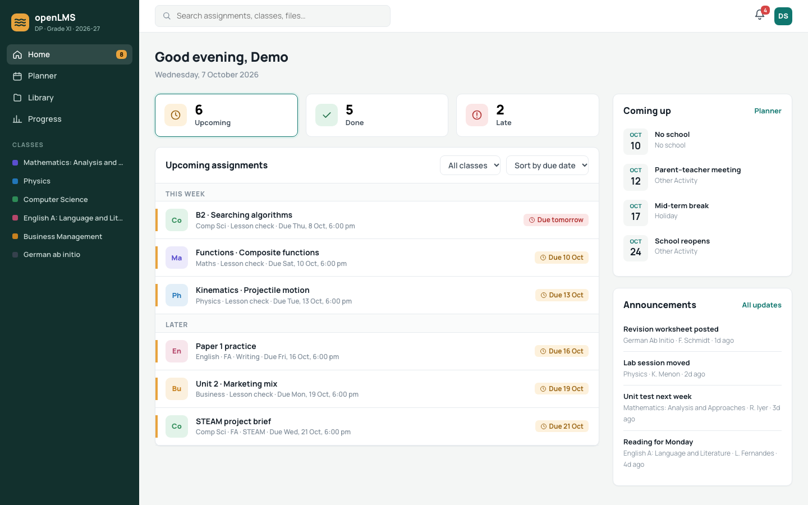

<div align="center">


# openLMS-indus

**A student wrapper for Indus LMS.** Sign in with your school account and see everything that's due in one click.

[](COPYING)
[](https://www.python.org)
[](#getting-started)

[Overview](#overview) • [Features](#features) • [Getting started](#getting-started) • [How it works](#how-it-works) • [Roadmap](#roadmap)



</div>

## Overview

Indus LMS spreads a student's work across 10 dashboard cards. A single subject keeps assignments in four separate places (EOL tests, FA, SA and learning tasks), with resources somewhere else. Finding everything that's due can take dozens of page loads. [`FINDINGS.md`](FINDINGS.md) documents the full audit.

openLMS puts all of it on one screen. Every assignment from every class is sorted into **Upcoming**, **Done** and **Late**, and each class gets one page with its posts, work and files.

openLMS signs in to Indus LMS as you and reads your data live. Anything that changes school data, such as submitting work, uploading files, taking tests or messaging, still happens on Indus LMS. openLMS takes you straight to the exact page with one click.

> [!NOTE]
> openLMS is an unofficial client. Your password is passed to Indus LMS once to sign you in and is never stored.

## Features

- **One assignments list.** Lesson checks, FA and SA tests, and learning tasks are merged into Upcoming, Done and Late, with class filtering, sorting and search.
- **One click to act.** Every assignment has a *Submit* or *Take test* button that opens the matching page on Indus LMS. EOL tests show their test ID.
- **A page for each class.** Each class has a stream of announcements, its assignments split by status, and shared resources grouped by folder.
- **Planner.** A month calendar shows school events and deadlines, coloured by status, plus your attendance.
- **Library.** Every shared file in one place, filterable by subject and type. You can optionally download them so they open offline.
- **Progress.** Graded results, completion per subject, and one feed of notifications and announcements.
- **Live, per-student sessions.** Each student signs in with their own account. Tokens refresh automatically, sessions survive server restarts, and files stream straight from the LMS.
- **Fast repeat loads.** The server caches each student's data with mixed TTLs (longer for slow resources), serves `ETag`/`304`s, and the browser keeps a stale fallback cleared on logout. Stale resources stay visible under an "Updating resources…" banner while fresh files load.
- **Demo mode.** *Explore with demo data* on the sign-in page shows the full app with made-up data, which is handy for presentations.
- **No build step.** The front end is plain HTML, CSS and JavaScript, and works on desktop and phones.

## Getting started

### Try the demo

You only need Python 3. With no data exported, the app loads the synthetic demo data in [`web/assets/data.example.js`](web/assets/data.example.js):

```bash
git clone https://github.com/StrangeSid/openLMS-indus.git
cd openLMS-indus
python3 -m http.server 8000 --directory web
```

Open <http://localhost:8000>.

### Run the server

The server signs students in and serves live data. You need Python 3.10+:

```bash
python3 -m venv .venv && source .venv/bin/activate
pip install -r requirements.txt
uvicorn openlms.app:app --port 8000
```

Open <http://localhost:8000> and sign in with your Indus LMS account, or choose **Explore with demo data**.

| Environment variable | Purpose |
|---|---|
| `OPENLMS_DATA_TTL` | Seconds to cache each student's data (default `300`) |
| `OPENLMS_FILES_TTL` | Seconds to reuse the slow resource crawl (default `3600`) |
| `OPENLMS_CACHE_SIZE` | Max students held in the in-process data cache (default `200`) |
| `OPENLMS_POOL_WORKERS` | Shared upstream fetch threads (default `16`) |
| `OPENLMS_SECURE_COOKIES=1` | Force `Secure` cookies when TLS ends at a proxy |
| `OPENLMS_SESSION_FILE` | SQLite session store path (default `.openlms-sessions.db`). Sessions survive restarts; `:memory:` disables persistence |
| `OPENLMS_SECRET_KEY` | Optional passphrase/Fernet key to encrypt tokens at rest. Without it they rest as plaintext in a `0600` file |
| `OPENLMS_PUBLIC_HOST` | Comma-separated public hostname(s) allowed past the CSRF Origin check behind a proxy (e.g. Cloudflare/ngrok) |
| `INDUSLMS_TENANT` | Fallback tenant ID if an account has none |

### Offline snapshot (no server)

1. Install the dependencies (they include [induslms-agent](https://github.com/StrangeSid/induslms-agent), which does the LMS API access) and log in once:

   ```bash
   pip install -r requirements.txt
   induslms login you@school.example
   ```

2. Export your data to `web/data.js`. Add `--files` to also download shared files into `web/files/`:

   ```bash
   python3 tools/export.py
   python3 tools/export.py --files
   ```

3. Serve `web/` with `python3 -m http.server 8000 --directory web` and reload. Run the export again whenever you want fresh data.

> [!IMPORTANT]
> `web/data.js` and `web/files/` contain your personal school data. Both are in `.gitignore`. Never commit them or publish the `web/` folder with them inside.

> [!TIP]
> Some files return `403 Forbidden`. These belong to classes you're not in, or teachers have restricted them. openLMS links those to Indus LMS instead.

## How it works

```
Browser ──► openlms/app.py ─────────────► Indus LMS API
web/*.html   sign-in, sessions, cached      api.induslms.com
   │         data.js (ETag/304, sections,   (parallel fetch via
   │         refresh), file proxy           induslms-agent)
   │               │
   │               ├─ openlms/cache.py: per-student payload (DATA_TTL)
   │               │  + slow resources (FILES_TTL), singleflight
   │               └─ openlms/data.py: fetches in parallel via induslms-agent and
   │                  shapes the result into the window.LMS object the pages render
   │
   └── Submit / Take test / Messaging ──► Indus LMS web app (induslms.com)
```

Every page loads `data.js`. The server answers it from the per-student cache when fresh (rebuilding only expired parts), and supports `?refresh=1` for a forced rebuild, `?sections=` slices, and `If-None-Match` → `304`. The browser also keeps a `localStorage` stale fallback (cleared on logout) used when `data.js` is unreachable. Without the server (the offline snapshot or the demo), `data.js` is a static file or falls back to the demo data. The pages work the same either way.

Action buttons link to the matching Indus LMS page, using the same `?subject=…&course_id=…` links the LMS's own calendar uses, so students finish the task there.

The app sorts each assignment into one of three states:

| State | Rule |
|---|---|
| **Upcoming** | Not submitted, and the deadline hasn't passed (or the work hasn't opened yet) |
| **Done** | Submitted or graded. Marked *Late* if it was turned in after the deadline. |
| **Late** | The deadline passed with no submission |

## Project structure

```
openlms/
  app.py              FastAPI server: sign-in, sessions, live data, file proxy, demo mode
  sessions.py         Persistent server-side sessions (SQLite, opaque HttpOnly cookie, optional Fernet)
  cache.py            In-process per-student data cache (mixed TTLs, singleflight, ETags)
  data.py             Fetch and shape LMS data (shared with the exporter)
web/
  login.html          Sign-in page (server mode)
  index.html          Home: Upcoming / Done / Late assignments
  class.html          Per-class page (?c=<subject>&tab=stream|work|files)
  planner.html        Calendar, deadlines, attendance
  library.html        All shared files
  progress.html       Results, completion, updates feed
  assets/
    app.js            Shared helpers, sidebar, assignment states, LMS links
    cache.js          Browser stale fallback for window.LMS (pre-data.js, cleared on logout)
    app.css           Design tokens and layout
    data.example.js   Synthetic demo data
tools/export.py       Offline snapshot to web/data.js
tests/                Unit tests (app, sessions, cache, exporter)
docs/                 README screenshot
FINDINGS.md           Audit of the current LMS: routes, API calls, click depth
```

Run the tests with:

```bash
pip install -r requirements-dev.txt
python3 -m unittest discover -s tests
```

## Roadmap

- [x] Assignments (lesson checks, FA and SA tests, learning tasks), classes, resources, announcements, calendar, attendance, notifications
- [x] Live sign-in with per-student sessions and a file proxy
- [x] Per-student data cache (mixed TTLs, ETag/304) and browser stale fallback for fast navigation
- [x] One-click links to Indus LMS for submitting, tests, messaging, policies, learning pathway and progress reports
- [ ] Doing those actions inside openLMS. This needs the school's approval and official API access first.

## Credits

Frontend Developer: Arnav V. Reddy  
Backend Developer: Siddhant Harsoda

Built on **[StrangeSid/induslms-agent](https://github.com/StrangeSid/induslms-agent)**, which provides the reverse-engineered API client and endpoint reference.

An unofficial student project. Not affiliated with or endorsed by the Indus Trust or Indus International School.
